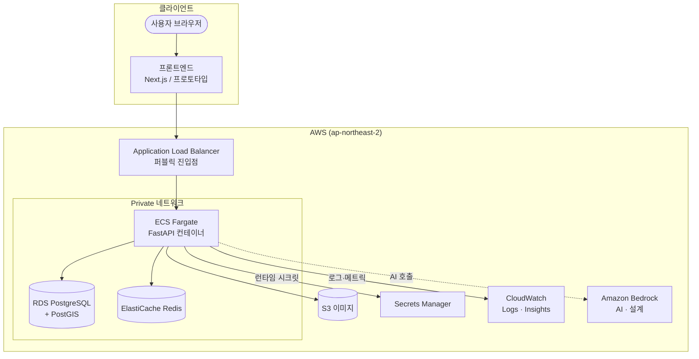
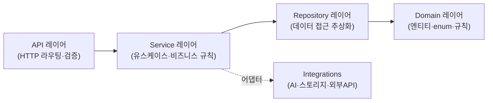
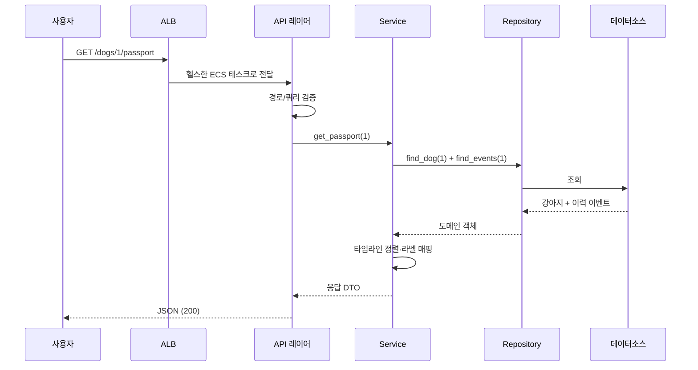
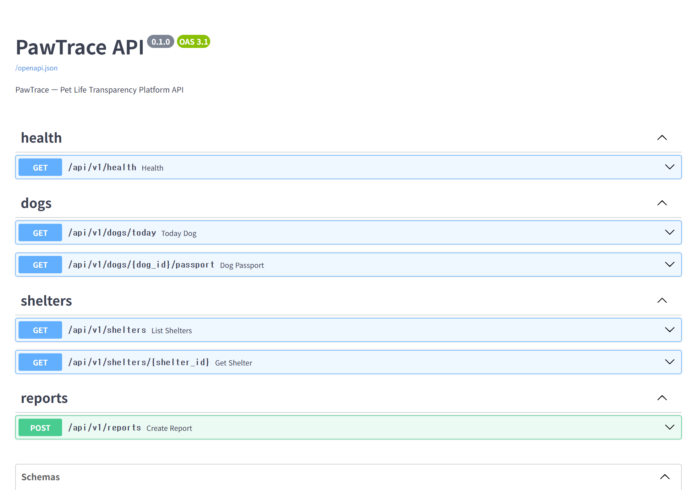

# 🏛️ ARCHITECTURE — 시스템 아키텍처

> **목적**: PawTrace의 전체 시스템 구조와 설계 원칙, 하나의 요청이 처리되는 과정을
> 코드를 보지 않고도 이해할 수 있도록 설명합니다.

---

## 1. 설계 원칙

| 원칙 | 적용 |
|---|---|
| **관심사 분리 (Separation of Concerns)** | API / 서비스 / 데이터 접근 / 도메인 레이어 분리 |
| **의존성 역전 (Clean Architecture)** | 바깥 레이어가 안쪽(도메인)에 의존, 그 반대는 금지 |
| **무상태 (Stateless)** | 애플리케이션은 상태를 갖지 않음 → 수평 확장 가능 |
| **12-Factor** | 설정은 환경변수, 로그는 stdout, 빌드/릴리스/실행 분리 |
| **외부 연동 격리** | DB·AI·스토리지는 어댑터로 감싸 교체 가능 |

## 2. 상위 수준 아키텍처



## 3. 애플리케이션 레이어 (Clean Architecture)

백엔드는 책임에 따라 레이어를 나누고, **의존성은 항상 안쪽(도메인)으로만** 향합니다.



| 레이어 | 책임 | 비유 |
|---|---|---|
| **API** | 요청/응답, 입력 검증, 스키마 정의 | 호텔 프런트데스크 |
| **Service** | 유스케이스 조합, 비즈니스 규칙 | 매니저 |
| **Repository** | 데이터 조회/저장 추상화 (DB 교체 가능) | 창고 담당 |
| **Domain** | 핵심 엔티티·enum·불변 규칙 | 회사 규정집 |
| **Integrations** | AI·스토리지 등 외부 의존성 격리 | 외주 업체 창구 |

> **왜 이렇게?** 데이터 소스(시드 → RDS)나 AI 제공자를 바꿔도 **도메인/서비스 코드는 그대로** 유지됩니다.
> 면접 포인트: *"테스트 가능성과 교체 가능성을 위해 의존성 방향을 통제했다."*

## 4. 요청 생명주기 (Request Lifecycle)

`GET /api/v1/dogs/{id}/passport` (강아지 여권 조회) 예시:



핵심: **각 레이어는 자기 책임만** 수행하고 다음 레이어에 위임합니다.
ALB는 **헬스체크를 통과한 태스크에만** 트래픽을 보냅니다(`/api/v1/health`).

> 아래는 FastAPI가 자동 생성한 OpenAPI 문서(Swagger UI)입니다. API 계약이 코드에서 바로 문서화됩니다.



## 5. 데이터 모델 (개념도)

> 상세 스키마/필드는 비공개입니다. 아래는 **개념적 관계**만 표현합니다.

```mermaid
erDiagram
    SHELTER ||--o{ DOG : "보유"
    DOG ||--o{ TIMELINE_EVENT : "이력"
    DOG ||--o{ REPORT : "신고 대상"
    SHELTER ||--o{ REPORT : "신고 대상"

    SHELTER {
        id PK
        name
        region
        is_gov_registered
        transparency_level
    }
    DOG {
        id PK
        name
        breed_label
        adoption_status
    }
    TIMELINE_EVENT {
        id PK
        event_type
        event_date
        source
    }
    REPORT {
        id PK
        status
        category
    }
```

- **투명성 지표(transparency_level)** 는 보호소 **정보의 완전성/검증 상태**를 나타내며,
  강아지를 평가하거나 업체를 단정하지 않습니다.
- 위치 검색은 **PostGIS**(공간 인덱스)를 활용하도록 설계.

## 6. 무상태 & 확장 전략

- 애플리케이션 컨테이너는 **상태를 갖지 않음** → 동일 이미지를 N개 실행 가능
- 세션/캐시 등 공유 상태는 **Redis**로 외부화
- 따라서 **수평 확장(scale-out)** 과 **오토스케일링**이 자연스럽게 가능
  (오토스케일링은 [ROADMAP](./ROADMAP.md) 참고)

## 7. 환경 구성 (현재 → 목표)

| 구성 | 현재 | 목표 |
|---|---|---|
| 데이터 소스 | 시드 데이터(즉시 동작) | RDS PostgreSQL + PostGIS |
| 실행 | 단일 태스크 | 오토스케일링(2~N) |
| 트래픽 | HTTP(80) | HTTPS(443) + WAF |
| 환경 | 단일 | dev / staging / prod 분리 |

## 8. 추천 스크린샷 📸

이 문서에 첨부하면 좋은 자료 (`assets/`):

- [ ] 강아지 여권(타임라인) 화면 캡처
- [ ] 지도 기반 보호소 검색 화면 캡처
- [ ] Swagger UI (`/docs`) — API 자동 문서
- [ ] 레이어 폴더 구조 트리 (코드 내용 없이 폴더명만)

---

📎 관련 문서: [INFRASTRUCTURE.md](./INFRASTRUCTURE.md) · [DECISIONS.md](./DECISIONS.md)
