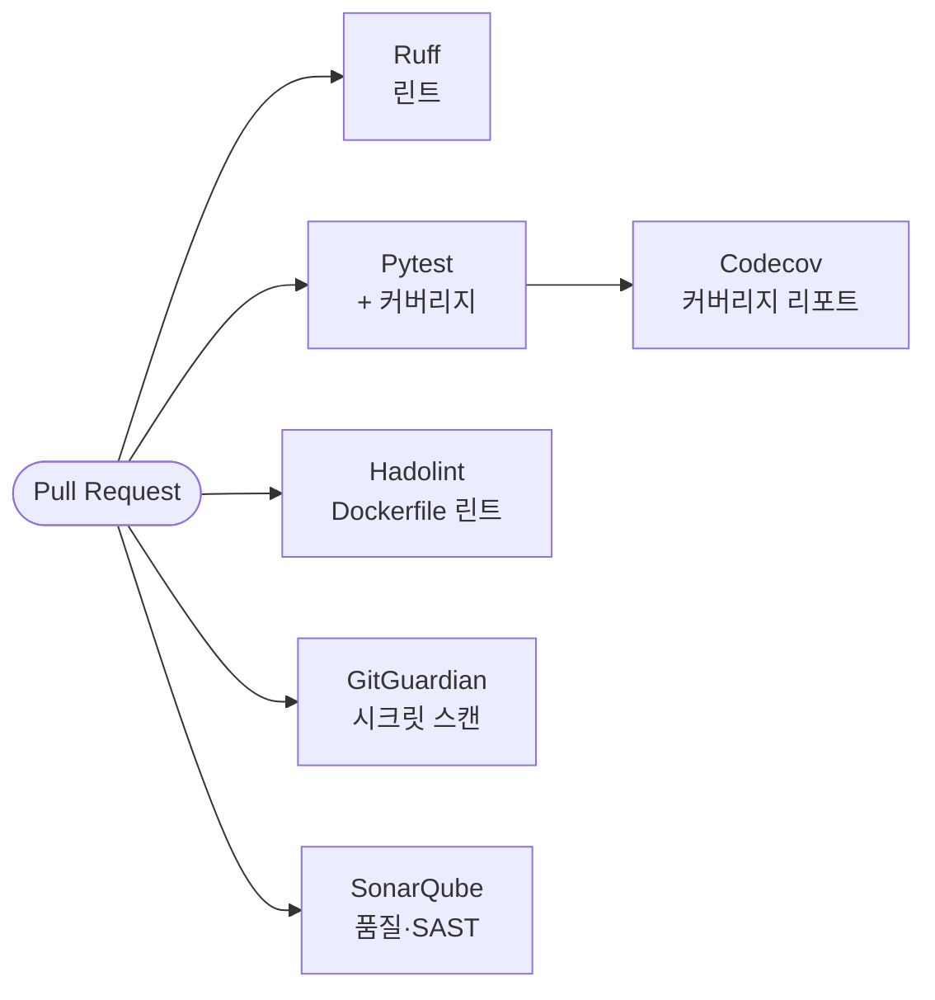
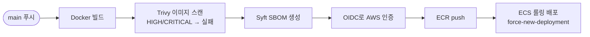
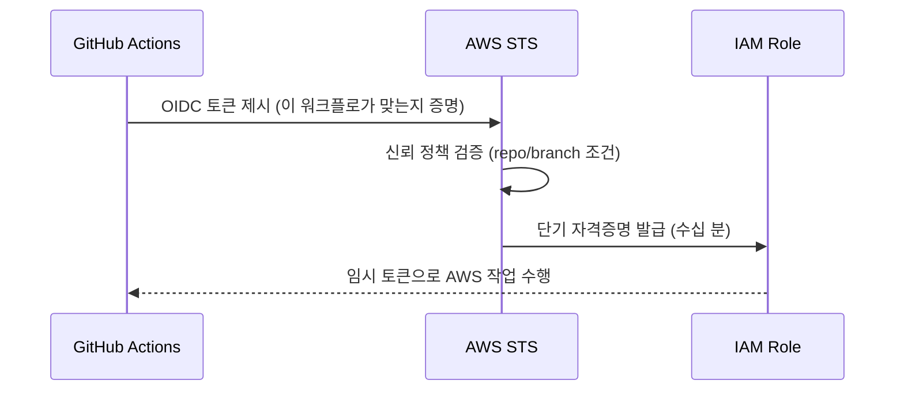
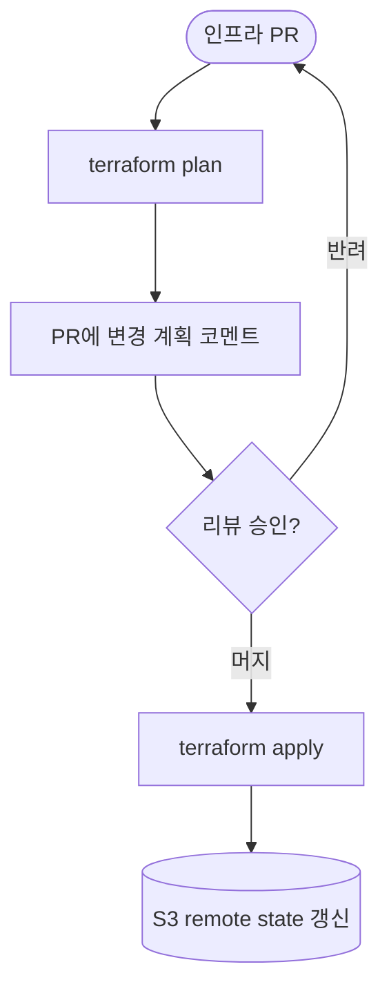

# 🔁 CI-CD — 배포 자동화 파이프라인

> **목적**: 코드/인프라 변경이 어떻게 검증되고 안전하게 배포되는지 설명합니다.
> 키리스 인증, 보안 게이트, GitOps 흐름을 다룹니다.

---

## 1. 개요 — 3개의 워크플로

| 워크플로 | 트리거 | 목적 |
|---|---|---|
| **CI** (`ci`) | PR · main 푸시 | 코드 품질 + 보안 게이트 (Shift-Left) |
| **앱 배포** (`deploy`) | main 푸시 | 이미지 빌드·스캔·배포 |
| **인프라** (`infra`) | PR · 머지 | Terraform GitOps |

> 핵심 원칙: **사람의 기억이 아니라 파이프라인이 품질·보안·인프라를 강제**한다.

## 2. CI 파이프라인 (품질·보안 게이트)

| 게이트 | 도구 | 막아내는 것 |
|---|---|---|
| 린트 | **Ruff** | 스타일/버그 패턴 |
| 테스트 | **Pytest + coverage** | 회귀 |
| 컨테이너 린트 | **Hadolint** | Dockerfile 안티패턴 |
| 시크릿 스캔 | **GitGuardian** | 키·토큰 커밋 |
| 정적 분석 | **SonarQube** | 취약/냄새 코드 |
| 커버리지 | **Codecov** | 테스트 부족 영역 |

> **Shift-Left**: 문제를 운영이 아니라 **PR 단계에서** 잡습니다.

## 3. 앱 배포 파이프라인

**단계별 설명**
1. **빌드** — `backend/`를 멀티스테이지 Docker 이미지로 빌드
2. **취약점 스캔(Trivy)** — HIGH/CRITICAL 발견 시 **배포 차단**
3. **SBOM(Syft)** — 포함된 패키지 목록(공급망 가시성) 생성
4. **OIDC 인증** — 장기 키 없이 단기 자격으로 AWS 접근
5. **ECR push** — 커밋 SHA를 태그로 이미지 업로드
6. **ECS 롤링 배포** — 새 태스크를 띄우고 헬스 통과 후 구버전 교체

> 안전장치: `DEPLOY_ENABLED` 플래그가 `true`일 때만 배포 잡 실행 → 실수 배포 방지.

## 4. OIDC 키리스 인증 🔐

가장 중요한 보안 설계입니다.

| 비교 | 기존(액세스키) | PawTrace(OIDC) |
|---|---|---|
| 자격증명 저장 | GitHub Secrets에 **장기 키 저장** | **저장 안 함** |
| 노출 시 | 폐기까지 계속 위험 | 수십 분 후 자동 만료 |
| 권한 범위 | 보통 광범위 | repo/branch 조건 + 최소 권한 |

- **배포 역할**: 신뢰 정책을 **main 브랜치로 제한**
- **인프라 역할**: PR plan을 위해 repo 전체(`:*`) 허용하되 권한은 분리

## 5. 인프라 GitOps 파이프라인

인프라 변경도 **코드 리뷰 → 자동 적용** 흐름을 따릅니다.

| 단계 | 동작 | 효과 |
|---|---|---|
| PR 생성 | `terraform plan` 실행 | **무엇이 바뀌는지 머지 전 확인** |
| plan 결과 | PR에 코멘트 | 리뷰어가 diff처럼 검토 |
| 머지 | `terraform apply` | 승인된 변경만 반영 |

> **GitOps의 핵심**: Git이 **인프라의 단일 진실 원천(Source of Truth)**.
> 콘솔에서 손으로 바꾸지 않고, 모든 변경이 PR 이력으로 남습니다.

## 6. 배포 전략 (현재 → 목표)

| 항목 | 현재 | 목표 ([ROADMAP](./ROADMAP.md)) |
|---|---|---|
| 배포 방식 | **롤링 업데이트** | Blue/Green + 자동 롤백 |
| 마이그레이션 | 수동/설계 | CI에서 Alembic 자동 실행 |
| 환경 | 단일 | dev/staging/prod 분리 |
| 배포 후 검증 | 헬스체크 | 스모크 테스트 + 자동 롤백 |

## 7. 파이프라인이 강제하는 보장

이 파이프라인을 통과한 변경은 다음을 **자동으로 보장**합니다.

- ✅ 린트·테스트 통과
- ✅ 시크릿 미포함 (GitGuardian)
- ✅ 알려진 HIGH/CRITICAL 취약점 없는 이미지 (Trivy)
- ✅ 패키지 구성표(SBOM) 보존
- ✅ 장기 키 미사용 (OIDC)
- ✅ 인프라 변경은 리뷰 후에만 적용

## 8. 추천 스크린샷 📸 (`assets/`)

- [ ] GitHub Actions 워크플로 성공 화면 (초록 체크)
- [ ] PR에 달린 `terraform plan` 코멘트
- [ ] Trivy 스캔 로그
- [ ] ECR에 푸시된 이미지 태그 목록
- [ ] ECS 배포 이벤트 (롤링) 화면

---

📎 관련 문서: [INFRASTRUCTURE.md](./INFRASTRUCTURE.md) · [DECISIONS.md](./DECISIONS.md) · [TROUBLESHOOTING.md](./TROUBLESHOOTING.md)
