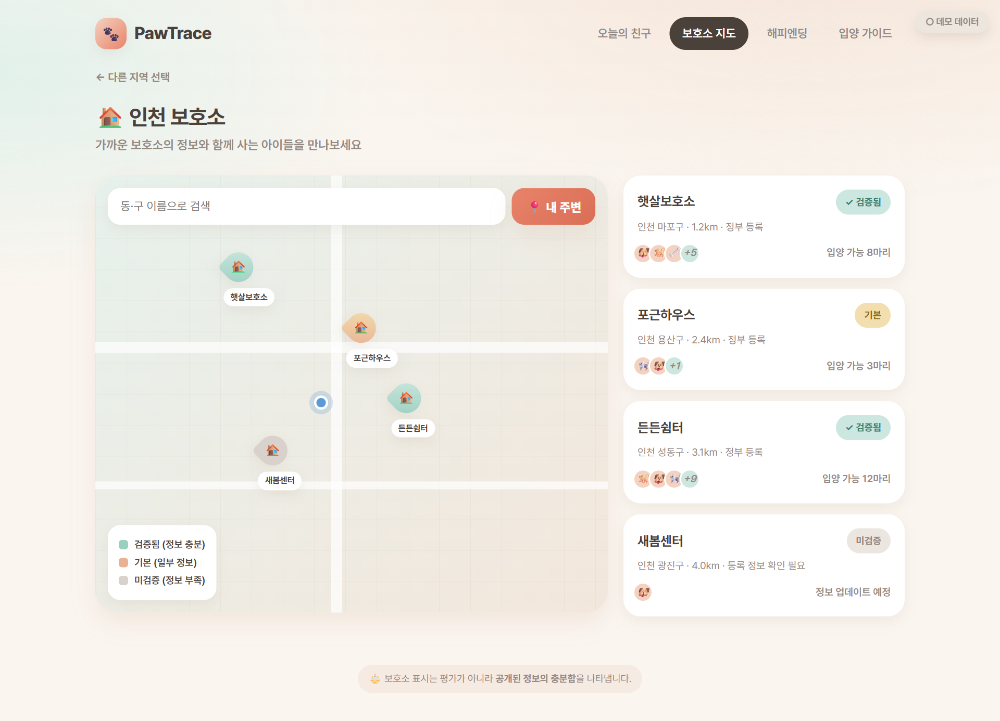
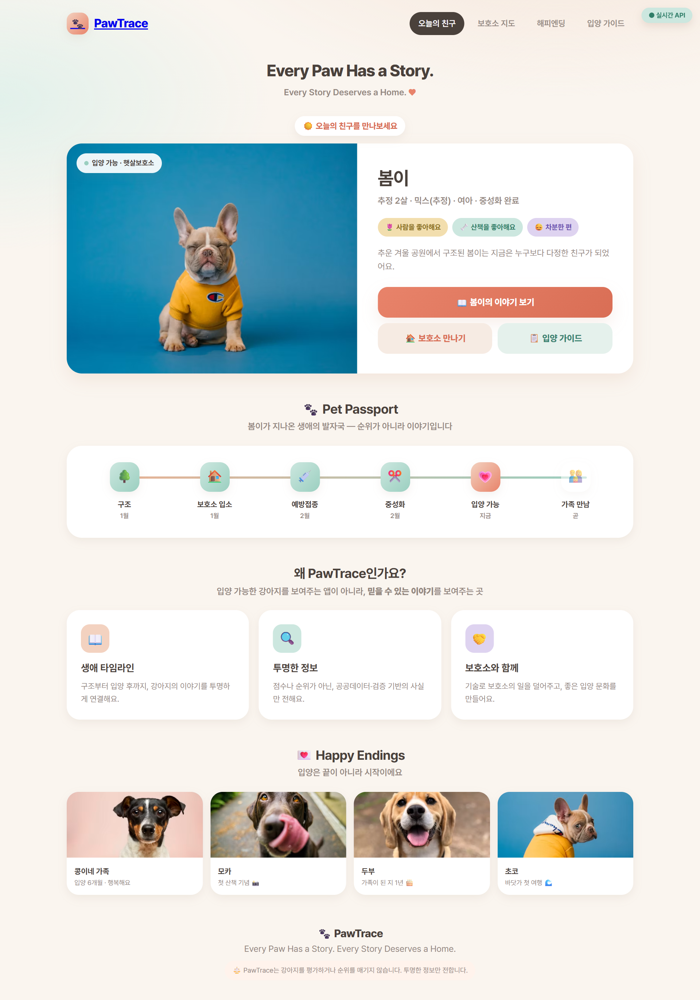
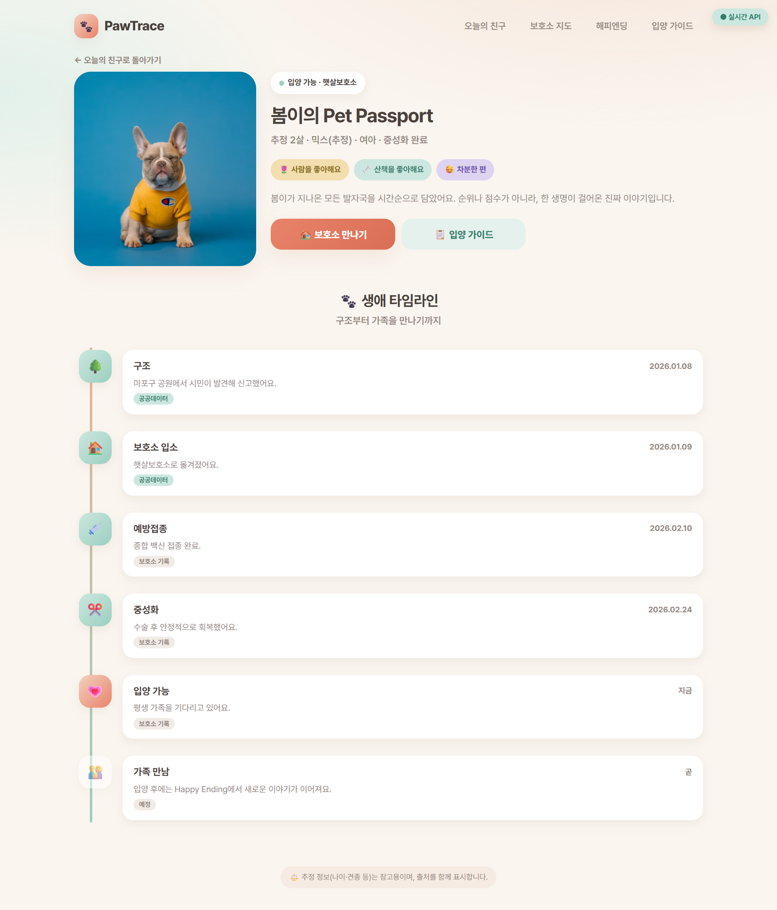

# 🐾 FEATURES — 제품 기능

> **목적**: PawTrace가 사용자에게 제공하는 기능을 **비기술 언어**로 설명합니다.
> 채용 담당자가 "이 사람이 무엇을 만들었는가"를 빠르게 이해할 수 있도록 작성했습니다.

---

## 서비스 한 줄 소개

> **신뢰할 수 있는 보호소와 강아지의 이력을 지도·타임라인으로 투명하게 보여주는 입양 플랫폼.**
> *Know where every paw begins.* 🐾

## 핵심 가치

PawTrace는 특정 업체를 비난하지 않습니다.
**공공데이터 · 사용자 신고 · 관리자 검증**에 기반한 **"투명성 지표"** 를 제공해,
사용자가 **정보에 근거해 스스로 판단**하도록 돕습니다.

---

## 기능 1 — 🗺️ 지도 기반 보호소 검색

지역을 기준으로 보호소를 지도에서 찾고, 상세 정보를 확인합니다.

- 지역별 보호소 조회
- 보호소 상세 (소개·위치)
- **정부 등록 여부** 표시
- **투명성 지표** (정보 완전성·검증 상태)
- 입양 가능한 강아지 목록 연결

> **투명성 지표란?** 보호소가 제공한 정보가 얼마나 완전하고 검증되었는지를 나타내는 신호이며,
> 강아지를 평가하거나 업체를 단정하지 않습니다.

**상태**: ✅ 프로토타입 구현 (지역 클릭 시 실시간 API 연동 확인)



---

## 기능 2 — 📋 강아지 이력 타임라인 ("강아지 여권")

강아지 한 마리의 **전 생애 이력**을 시간 순서로 보여줍니다.

```
구조 → 보호소 입소 → 건강검진 → 예방접종 → 중성화 → 입양 가능 → 입양 완료
```

- 구조일 / 구조 위치
- 보호소 입소일
- 건강검진 · 예방접종 기록
- 중성화 여부
- 입양 가능 상태 / 입양 완료 여부
- 각 기록의 **출처(source)** 표기 (공공데이터 / 보호소 / 사용자)

> 흩어진 정보를 하나의 타임라인으로 통합해, 사용자가 **출처와 이력을 한눈에** 확인합니다.



**상태**: ✅ 프로토타입 구현 (여권 화면 실시간 API 연동 확인)



---

## 기능 3 — 🚩 신고 / 검증 시스템

사용자가 의심 사례를 제보하고, 관리자가 검토해 투명성 지표에 반영합니다.


- 사용자가 신고 등록 (설명·증빙 이미지)
- 관리자가 검토
- 검토 결과에 따라 보호소 투명성 지표 반영

> 표현은 항상 중립적: "검증 필요 / 투명성 낮음 / 공공데이터 불일치".

**상태**: 🟡 설계 (백엔드 모델·워크플로 정의)

---

## 기능 4 — 🤖 AI 보조

반복적인 텍스트 처리를 AI로 자동화해 운영 효율과 사용성을 높입니다.

- 입양 후기 **요약**
- 신고 내용 **분류**
- 보호소 설명 **자동 요약**
- 이상 징후 **키워드 탐지**

> AI는 보조 도구이며, 최종 판단/공개는 **관리자 검증**을 거칩니다.

**상태**: 🟡 설계 (Amazon Bedrock 연동 지점 격리 설계 완료)

---

## 기능 5 — 🛠️ 관리자 콘솔

서비스 운영을 위한 백오피스 기능.

- 보호소 등록 / 수정 / 검토
- 강아지 정보 등록 / 수정
- 신고 내역 관리
- 투명성 지표 관리

**상태**: 🟡 설계

---

## 기능 6 — 👤 회원 · 입양 신청

강아지 이력을 넘어 **실제 입양으로 이어지는 흐름**을 회원 기반으로 제공합니다.

- 이메일 회원가입 / 로그인 (비밀번호는 **bcrypt 해시**로만 저장, JWT 발급)
- 마음에 든 강아지에 **입양 신청** (한마디 메시지 첨부 가능)
- 보호소 직원이 신청자 목록을 확인 → 진행 단계(status) 관리
- 입양이 성사되면 **입양 관계(Adoption)** 로 기록 → 이후 Family Journey의 토대

> 신청 status는 '진행 단계'일 뿐, 사람을 합격/불합격으로 **평가하지 않습니다.**

**상태**: ✅ 백엔드 구현 (회원/인증·신청 API + 모델)

---

## 기능 7 — 📔 Family Journey (입양 이후 기록)

*"입양은 끝이 아니라 시작"* — 입양자가 분기별로 반려생활을 기록합니다.

- **입양한 사용자만** 작성 가능
- 분기 라벨·사진·이야기로 성장 타임라인 축적
- 댓글은 없고 **'응원(cheer)'만** 받을 수 있어 부담 없는 공간
- 꾸준한 기록에는 **쿠폰 보상** 지급 (쇼핑몰에서 사용)

**상태**: ✅ 백엔드 구현 (기록·응원·보상 연동)

---

## 기능 8 — 🎓 PawTrace Academy (입양 준비 교육)

책임 있는 입양을 준비하도록 돕는 **교육 콘텐츠 + 퀴즈**.

- 과정별 학습 콘텐츠와 퀴즈 문항
- 통과 시 **수료 배지(AcademyCompletion)** 발급
- 입양 준비 프로필 · 체크리스트 작성 (Trust Profile)

> 각 항목은 '준비 활동'일 뿐 합격/불합격 기준이 아니며, 강아지를 추천하지 않습니다.

**상태**: ✅ 백엔드 구현 (과정·퀴즈·수료·프로필 API)

---

## 기능 9 — 🛒 굿즈 쇼핑몰 (수익 → 보호소 후원)

미션과 연결된 커머스. **판매액 일부가 보호소 후원으로 적립**됩니다.

- 상품 목록/카테고리 · **장바구니**(로그인, PostgreSQL 영속 저장)
- **결제(주문)** — 재고 차감 + 쿠폰 적용 + 후원액 계산을 **하나의 트랜잭션**으로 처리
- 주문 내역 · 보유 쿠폰 조회
- 누적 판매/후원 적립을 보여주는 **임팩트 지표(`/shop/impact`)**

> 재고·쿠폰 **정합성**이 핵심이라, 이 결제 경로는 부하테스트의 **'쓰기·동시성' 워크로드**로 활용됩니다
> ([SRE-PORTFOLIO](./SRE-PORTFOLIO.md)).

**상태**: ✅ 백엔드 구현 (장바구니·주문·재고·쿠폰·후원 적립)

---

## 기능 성숙도 요약

| 기능 | 상태 |
|---|---|
| 지도 기반 보호소 검색 | ✅ 프로토타입 (API 연동) |
| 강아지 이력 타임라인 | ✅ 프로토타입 (API 연동) |
| 회원 · 입양 신청 | ✅ 백엔드 구현 |
| Family Journey (입양 이후 기록) | ✅ 백엔드 구현 |
| PawTrace Academy (교육/수료) | ✅ 백엔드 구현 |
| 굿즈 쇼핑몰 (커머스·후원 적립) | ✅ 백엔드 구현 |
| 신고/검증 시스템 | 🟡 접수 API + 검증 워크플로 설계 |
| AI 보조 (Bedrock) | 🟡 연동 지점 격리 설계 |
| 관리자 콘솔 | 🟡 일부 API 구현 |

> ✅ = 구현/동작 확인 · 🟡 = 설계·일부 구현, 확장 예정 ([ROADMAP](./ROADMAP.md))

---

## UX 방향

- 입양이라는 따뜻한 주제에 맞춰 **둥글둥글하고 친근한** 비주얼
- 정보는 **단순·명확**하게, 지표는 **중립적 표현**으로
- 모바일에서도 지도·타임라인이 자연스럽게 보이도록 설계

## 추천 스크린샷 📸 (`assets/`)

- [ ] 메인 화면 (오늘의 강아지)
- [ ] 지도 보호소 검색 화면
- [ ] 강아지 여권(타임라인) 화면
- [ ] (구현 후) 신고 폼 / 관리자 콘솔

---

📎 관련 문서: [README.md](./README.md) · [ARCHITECTURE.md](./ARCHITECTURE.md) · [ROADMAP.md](./ROADMAP.md)
