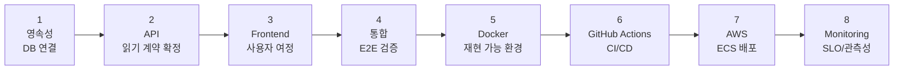

# 🗺️ Implementation Plan & Sprint Board

> **이 문서의 목적**: PawTrace를 "기능 나열"이 아니라 **출시 가능한 MVP**로 만들기 위한
> 실행 로드맵과 스프린트 보드. 제품 비전과 현재 구현을 정렬(align)하고, 무엇을 먼저·왜 그 순서로
> 만드는지를 CTO 관점에서 설명한다.
>
> 작성 관점: Technical Product Manager / Solution Architect.

---

## 1. 설계 철학 — "한 경로를 끝까지 관통시킨다"

신규 프로젝트에서 가장 흔한 실패는 **모든 기능을 동시에 30%씩 만드는 것**이다.
PawTrace는 반대로 간다:

> **하나의 사용자 여정을 DB → API → 화면까지 끝까지 관통시키고, 나머지는 그 경로를 복제한다.**

첫 관통 경로: **"오늘의 친구"** (홈에서 추천 강아지 1마리 표시).
이 경로가 완성되면 데이터 흐름 전체(영속성 → 비즈니스 규칙 → 계약 → UI)가 한 번 검증되고,
지도·여권·신고 기능은 이 검증된 골격의 변형으로 빠르게 확장된다.

---

## 2. 아키텍처가 먼저 — "코드 전에 구조"

> 아키텍처 상세는 [ARCHITECTURE.md](./ARCHITECTURE.md) 참고.

PawTrace 백엔드는 **Clean Architecture**(api → service → repository → domain)로 설계되어,
데이터 소스를 교체해도 **상위 계층(비즈니스 규칙·API 계약)이 바뀌지 않는다.**

이 설계의 실전 가치:

| 결정 | 효과 (포트폴리오 포인트) |
|---|---|
| Repository 패턴으로 데이터 접근 격리 | 데이터 소스 교체가 **국소 변경**으로 끝남 (상위 무수정) |
| Service가 dict 계약으로 통신 | Repository 내부 구현과 무관하게 비즈니스 규칙 유지 |
| Integration(AI/공공데이터/스토리지) 어댑터 격리 | 외부 의존성 장애가 핵심 도메인으로 전파되지 않음 |
| 환경변수 기반 설정 | 로컬·CI·운영을 **동일 코드/다른 설정**으로 운용 |

> **결론: 향후 Docker · GitHub Actions · ECS · Redis · PostgreSQL · AI · Monitoring 도입에
> 대규모 리팩터링이 필요 없다.** 확장 지점이 이미 인터페이스로 분리되어 있기 때문.

---

## 3. 실행 로드맵 (8단계)

각 단계는 **이전 단계가 검증되어야 시작**한다. 화면을 먼저 그리지 않고,
데이터가 실제로 흐르는지부터 증명한 뒤 위로 쌓아 올린다.

---

## 4. 스프린트 보드

> 1인 개발 · 하루 3~5시간 · 학습 병행 기준. 각 스프린트는
> **Backend · Frontend · DevOps · Testing** 4축을 모두 포함해 "수직 슬라이스"로 완결한다.
> (목표는 기능 완성이 아니라 **출시 가능한 증분**)

### 🧱 Sprint 1 — Persistence Foundation
> *"데이터가 흐르게"*

| 축 | 핵심 작업 |
|---|---|
| Backend | DB 스키마 + 마이그레이션 도구(Alembic) 도입, 데이터 접근 계층을 ORM 쿼리로 연결, 멱등 시드 스크립트 |
| Frontend | 앱 초기화 + 디자인 토큰(둥근·따뜻한 테마), "오늘의 친구" 홈 화면 |
| DevOps | `docker compose` 한 줄로 DB→마이그레이션→시드→API 자동 기동 |
| Testing | Repository 단위테스트(DB), 읽기 API 계약(스키마 1:1) 테스트, CI에서 마이그레이션 실행 |

**DoD**: DB에 저장된 강아지가 홈 화면에 렌더되고, 컨테이너를 재기동해도 데이터가 유지된다.

### 🗺️ Sprint 2 — Read Journey E2E
> *"여정 완성"*

| 축 | 핵심 작업 |
|---|---|
| Backend | 강아지 상세 / 보호소 상세 / 보호소별 강아지 목록, 위치 기반 검색(PostGIS), 날짜 기반 추천 회전 |
| Frontend | 지도(마커·현재위치·상세 바텀시트), 강아지 여권 타임라인 UI, 출처·추정 라벨 표기 |
| DevOps | 프론트엔드 빌드 파이프라인 / 프리뷰 환경 |
| Testing | 타임라인 정렬 테스트, **지도→보호소→강아지→여권** 전 구간 E2E |

**DoD**: 사용자가 지도에서 시작해 강아지 여권까지 실제 클릭으로 완주한다.

### 🔐 Sprint 3 — Write + Auth (Reports / Admin)
> *"신뢰를 만드는 쓰기 경로"*

| 축 | 핵심 작업 |
|---|---|
| Backend | 신고 등록·검토, 이미지 업로드(EXIF 제거), 투명성 지표 반영, JWT 인증, 관리자 CRUD |
| Frontend | 신고 폼, 관리자 대시보드, 신고 검토 화면 |
| DevOps | 지도 검색 Redis 캐싱, 시크릿(JWT 키) 주입 |
| Testing | 인증·권한 우회 테스트, 신고 라이프사이클 테스트 |

**DoD**: 사용자가 의심 사례를 신고하면 저장되고, 관리자가 로그인해 검토·반영한다.

> ⚖️ 표현 원칙: "불법/펫샵 확정" 같은 단정 금지. **"검증 필요 · 공공데이터 불일치 · 투명성 낮음"**
> 같은 중립적 지표로만 노출. (제품 가치이자 법적 리스크 관리 — [DECISIONS.md](./DECISIONS.md) 참고)

### 🚀 Sprint 4 — Release + Observability
> *"배포 가능한 MVP + 관측"*

| 축 | 핵심 작업 |
|---|---|
| Backend | 에러 응답 표준화, 캐시 TTL 정리, 공공데이터 연동 조사 |
| Frontend | 컨테이너화, 반응형·접근성 마무리 |
| DevOps | CD(build→ECR→ECS), 배포 시 **DB 마이그레이션 자동 실행**, 시크릿 관리, **CloudWatch 대시보드·알람·SLO/SLI** |
| Testing | 배포 리허설(apply→migrate→seed→smoke), 롤백 검증, 가벼운 부하 테스트(k6) |

**DoD**: AWS에 배포되고, 대시보드에서 지연·에러(골든 시그널)를 관측하며, 임계 초과 시 알림이 온다.

---

## 5. "코드 전에 해결한" 설계 질문들

좋은 엔지니어링은 코딩 전에 함정을 제거한다. 착수 전에 내린 결정들:

- **위치 컬럼을 미리 만든다** — 반경검색은 Sprint 2지만, 첫 마이그레이션에 좌표·geometry 컬럼을
  포함해 **재마이그레이션을 방지**한다.
- **비즈니스 규칙은 Service에** — "오늘의 친구" 선정 같은 규칙을 데이터 계층에 하드코딩하지 않고
  Service로 올려 테스트·교체가 쉽게.
- **마이그레이션을 CI에서 실제 실행** — "내 PC에선 됐는데"를 구조적으로 차단.
- **로컬은 합치고 운영은 분리** — 마이그레이션을 로컬 compose에선 편의상 합치되,
  운영(ECS)에선 별도 run-task로 분리해 배포 안전성 확보.

---

## 6. 진행 추적

스프린트와 작업은 GitHub Milestones / Issues로 관리된다
(Sprint 1–4 마일스톤 + 축별 작업 이슈 + 스프린트 추적 이슈).
이 보드는 "무엇을 했나"가 아니라 **"왜 이 순서로 하는가"**를 보여주기 위한 것이다.

> 관련 문서: [ROADMAP.md](./ROADMAP.md) · [ARCHITECTURE.md](./ARCHITECTURE.md) · [FEATURES.md](./FEATURES.md)
