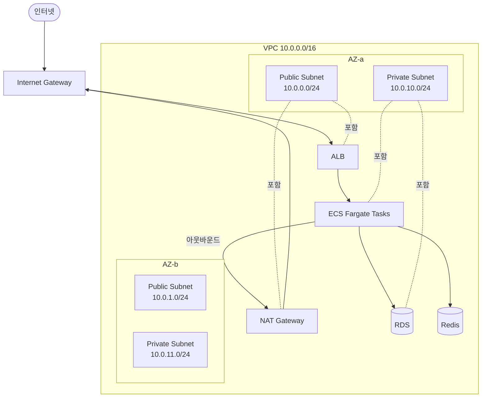
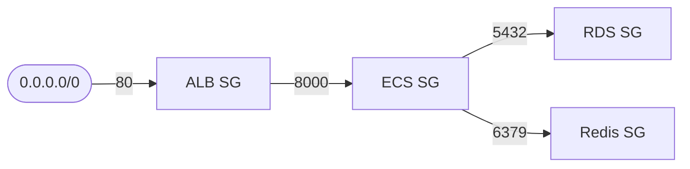
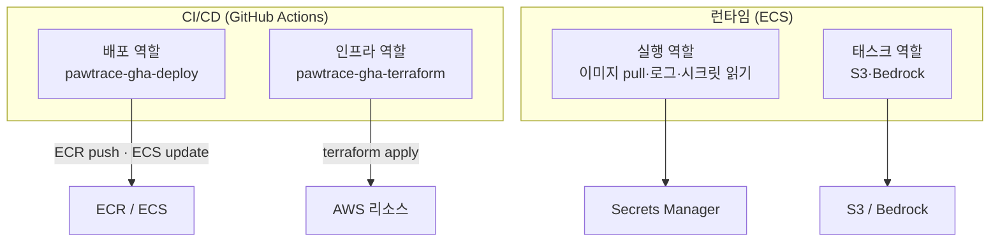
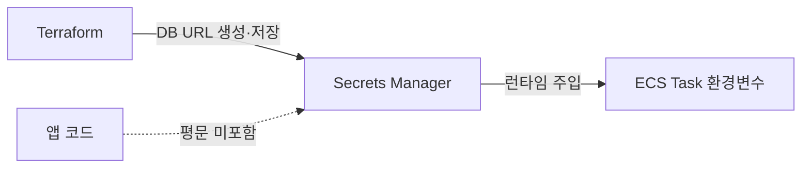
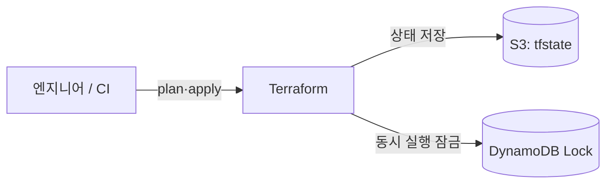

# ☁️ INFRASTRUCTURE — AWS 인프라

> **목적**: PawTrace가 AWS 위에서 어떻게 구성·격리·보호되는지 설명합니다.
> 모든 인프라는 **Terraform 코드**로 정의되어 있어 재현 가능합니다. (코드 자체는 비공개)

---

## 1. 한눈에 보기

| 항목 | 값 |
|---|---|
| **클라우드** | AWS |
| **리전** | `ap-northeast-2` (서울) |
| **가용영역** | 2 AZ (고가용성 기반) |
| **컴퓨트** | ECS Fargate (서버리스 컨테이너) |
| **DB** | RDS PostgreSQL 16 (+ PostGIS) |
| **캐시** | ElastiCache Redis 7 |
| **스토리지** | S3 (이미지) |
| **시크릿** | Secrets Manager |
| **레지스트리** | Amazon ECR |
| **IaC** | Terraform (S3 + DynamoDB remote state) |

## 2. 네트워크 토폴로지



**설계 의도**
- 외부에서 직접 접근 가능한 것은 **ALB(public 서브넷)** 뿐
- **ECS·RDS·Redis는 모두 private 서브넷** → 인터넷에서 직접 도달 불가
- private 서브넷의 외부 호출(이미지 pull 등)은 **NAT Gateway** 경유
- 2개 AZ에 서브넷을 분산해 **단일 AZ 장애에 대비**

## 3. 트래픽 흐름 (Ingress)

```
인터넷 → IGW → ALB(80) → Target Group → ECS Task(8000)
                              │
                              └─ Health Check: GET /api/v1/health (200 기대)
```

- ALB는 **헬스체크를 통과한 태스크에만** 트래픽 분배
- Target type = `ip` (Fargate `awsvpc` 네트워크 모드)
- 🟡 현재 HTTP(80). HTTPS(443/ACM)는 [ROADMAP](./ROADMAP.md)에서 추가 예정

## 4. 보안 그룹 체인 (최소 권한)

각 계층은 **바로 앞 계층에서 오는 트래픽만** 허용합니다.



| 보안 그룹 | 인바운드 허용 | 출처 |
|---|---|---|
| ALB SG | 80 | 인터넷 |
| ECS SG | 8000 | **ALB SG에서만** |
| RDS SG | 5432 | **ECS SG에서만** |
| Redis SG | 6379 | **ECS SG에서만** |

> 포인트: IP가 아니라 **보안그룹 참조**로 허용 → 스케일링/IP 변경에도 규칙이 깨지지 않음.

## 5. 데이터 계층

### RDS PostgreSQL
- 엔진 PostgreSQL 16, private 서브넷 그룹 배치
- **저장 시 암호화(at-rest)** 활성화
- `publicly_accessible = false` (인터넷 비노출)
- 위치 검색을 위한 **PostGIS** 확장 사용 설계
- 🟡 운영 전환 시: 자동 백업·최종 스냅샷·Multi-AZ 적용 ([ROADMAP](./ROADMAP.md))

### ElastiCache Redis
- private 서브넷, ECS에서만 접근
- 캐싱/임시 상태 외부화 → 앱 무상태 유지

### S3
- 강아지·증빙 이미지 저장
- 접근은 **태스크 역할(IAM)** 로 제한된 버킷 경로에 한정

## 6. IAM 설계 (역할 분리 · 최소 권한)



| 역할 | 용도 | 권한 범위 |
|---|---|---|
| **배포 역할** (CI) | 앱 이미지 push, ECS 서비스 갱신 | ECR + ECS (좁음) |
| **인프라 역할** (CI) | Terraform apply/plan | 인프라 관리 (PowerUser + 스코프드 IAM) |
| **실행 역할** (ECS) | 이미지 pull, 로그 전송, **시크릿 읽기** | 한정된 시크릿만 |
| **태스크 역할** (ECS) | 앱 런타임 권한 | 특정 S3 경로 + Bedrock |

> **왜 4개로 나눴나?** 한 역할이 모든 권한을 가지면 침해 시 피해가 큼.
> "배포 vs 인프라", "실행 vs 런타임"을 분리해 **폭발 반경(blast radius)** 을 줄였습니다.

## 7. 시크릿 관리



- DB 접속 URL은 **코드/이미지에 없음** → Secrets Manager에 저장
- ECS 태스크가 **시작 시점에 환경변수로 주입**받음
- 실행 역할에는 **해당 시크릿 1개만** 읽을 권한 부여

## 8. 상태 관리 (Terraform Remote State)



- **S3**: 인프라의 현재 상태(state)를 단일 위치에 저장 → 협업·CI에서 공유
- **DynamoDB Lock**: 동시에 두 명이 apply하는 사고 방지
- 부트스트랩(OIDC·역할·ECR·state 저장소)은 **1회성**으로 분리 구성

> 관련 사례: 로컬 폴더 혼선으로 state가 이원화될 뻔한 사건 → [TROUBLESHOOTING.md](./TROUBLESHOOTING.md)

## 9. 비용 전략 💰

포트폴리오 환경의 **현실적 비용 관리** 방식:

- 평소에는 `terraform destroy`로 과금 리소스(RDS·NAT·ALB)를 내려둠
- 데모/면접 직전 `terraform apply`로 **약 5분 내 전체 재현**
- 부트스트랩 리소스(OIDC·역할·ECR·state)는 거의 무료라 상시 유지
- 🟡 PR 단위 비용 가시화(**Infracost**)는 [ROADMAP](./ROADMAP.md)

> 면접 포인트: *"IaC 덕분에 인프라를 켰다 끄는 것을 비용 통제 수단으로 사용했다."*

## 10. 검증된 사실 ✅

- `terraform apply`로 **약 39개 리소스**(VPC~RDS)를 일괄 생성
- ALB 주소에서 API 엔드포인트가 정상 응답함을 확인
- 비용 관리를 위해 데모 후 `destroy`

## 11. 추천 스크린샷 📸 (`assets/`)

- [ ] `terraform apply` 완료 화면 (`Apply complete! N added`)
- [ ] AWS 콘솔 — ECS 서비스 RUNNING / 태스크 헬스
- [ ] AWS 콘솔 — VPC 리소스 맵
- [ ] CloudWatch 로그 스트림
- [ ] 보안그룹 인바운드 규칙 표

---

📎 관련 문서: [ARCHITECTURE.md](./ARCHITECTURE.md) · [CI-CD.md](./CI-CD.md) · [DECISIONS.md](./DECISIONS.md)
