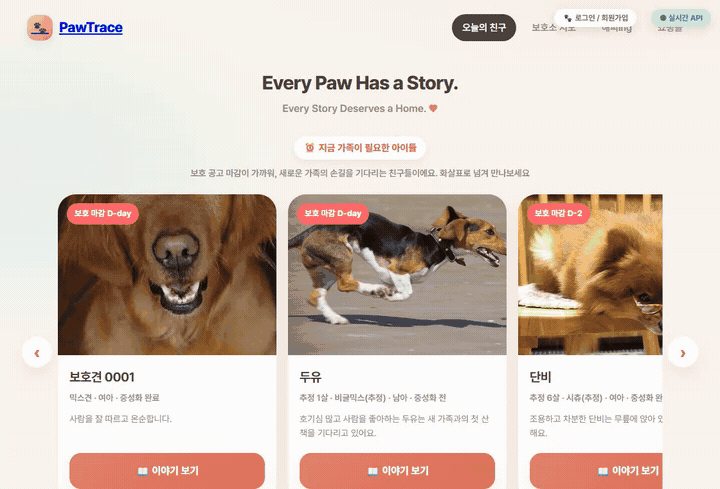

<div align="center">

# 🐾 PawTrace

### *Know where every paw begins.*

보호소와 강아지의 **이력을 지도와 타임라인으로 투명하게** 보여주어,
신뢰할 수 있는 입양 문화를 돕는 플랫폼입니다.

📘 **처음 보시나요? → [전체 구조 문서 (ARCHITECTURE.md)](ARCHITECTURE.md)** 에서 아키텍처 전체를 쉬운 용어로 설명합니다.

<br/>



*공고 마감이 가까운 친구들 → 대한민국 보호소 지도 → 보호소 지도 탭 → 해피ing 까지의 실제 동작 흐름*

> 📌 이 저장소는 **공개용 문서 저장소**입니다. 실제 소스 코드는 비공개로 관리되며,
> 채용 담당자와 기술 면접관이 **코드를 보지 않고도 프로젝트 전체를 이해**할 수 있도록 설계되었습니다.

</div>

---

## 🌟 PawTrace는 무엇이 다른가요?

기존 입양 앱들은 대부분 **"지금 입양 가능한 아이 목록"** 을 보여주는 데 그칩니다.
PawTrace는 **목록이 아니라 "이력과 신뢰"** 를 보여줍니다.

| | 기존 입양 앱 | 🐾 PawTrace |
|---|---|---|
| 핵심 | 입양 가능한 강아지 목록(스냅샷) | 강아지의 **출처와 이력 타임라인** |
| 신뢰 | 보호소 정보 나열 | **투명성 지표(신뢰도 점수)** + 근거 공개 |
| 데이터 | 일방향 제공 | 사용자 신고 → 관리자 검증 **참여형 루프** |
| 정보 해소 | 직접 읽어야 함 | **AI 요약·분류**로 정보 비대칭 완화 |

> 한 줄 차별점: **다른 앱은 '입양 가능한 강아지'를 보여주고, PawTrace는 '믿을 수 있는 출처와 이력'을 보여줍니다.**

---

## ✨ 핵심 기능

- 🗺️ **지도 기반 보호소 검색** — 현재 위치/지역 기준, 정부 등록 여부·신뢰도 표시
- 🐶 **강아지 이력 타임라인** — 구조 → 입소 → 건강검진 → 예방접종 → 중성화 → 입양
- 🙋 **신고/검증 시스템** — 사용자가 의심 사례를 신고하면 관리자가 검토 후 신뢰도에 반영
- 🤖 **AI 보조** — 신고 분류, 보호소 설명 요약(이상 징후 키워드 탐지는 확장 단계)
- 🛠️ **관리자 기능** — 보호소·강아지·신고·신뢰도 관리

> ⚖️ PawTrace는 특정 업체를 "불법"으로 단정하지 않습니다. 공공데이터·사용자 신고·관리자 검증에 기반한
> **"검증 필요 / 투명성 낮음 / 공공데이터 불일치"** 같은 **투명성 지표**로만 표현합니다.

---

## 🧱 기술 스택

| 영역 | 기술 |
|---|---|
| Frontend | Next.js, Kakao Map SDK |
| Backend | FastAPI (Python) |
| Database | PostgreSQL + PostGIS |
| Cache | Redis |
| AI | Amazon Bedrock / OpenAI API |
| Infra | Docker, AWS ECS Fargate (→ EKS 확장), **Terraform (IaC)** |
| CI/CD | GitHub Actions — **앱 배포(`deploy.yml`) + 인프라 배포(`infra.yml`, GitOps)** |
| 인증 | **OIDC 키리스** (GitHub→AWS, 액세스키 미저장) |
| 보안(DevSecOps) | Trivy · SonarQube · GitGuardian · Hadolint · Codecov · Syft(SBOM) · Dependabot · pre-commit |

---

## 🏗️ 아키텍처 (개요)

```
[ Next.js + Kakao Map ]  (CloudFront + S3)
        │ REST
        ▼
[ ALB ] → [ FastAPI on ECS Fargate ]
   │            ├──── [ Amazon RDS for PostgreSQL + PostGIS ]  (보호소/강아지/이력/신고)
   │            ├──── [ Amazon ElastiCache (Redis) ]           (오늘의 공고/지역 카운트 캐싱)
   │            └──── [ Amazon Bedrock ]                        (신고 분류 · 요약)
   │
   └──── [ Amazon S3 ]  (신고 이미지)

[ GitHub Actions ] → Docker build → Amazon ECR → ECS Fargate (rolling deploy)
```

> 🚀 **실제 AWS 배포 검증 완료** — `terraform apply`로 39개 리소스(VPC~RDS)를 생성하고
> ALB 주소에서 `/api/v1/dogs/today`가 정상 응답함을 확인했습니다. (비용 관리를 위해 데모 후 `destroy`)
> 📐 상세 다이어그램·매핑표: [`INFRASTRUCTURE.md`](INFRASTRUCTURE.md)

---

## 🔁 배포 & 운영 (GitOps)

배포는 **두 개의 GitHub Actions 파이프라인**으로 자동화되어 있습니다.

| 파이프라인 | 트리거 | 하는 일 |
|---|---|---|
| `deploy.yml` (앱) | main 푸시 | Docker 빌드 → Trivy 스캔 → SBOM → OIDC 인증 → ECR push → ECS 롤링 배포 |
| `infra.yml` (인프라) | PR / main 머지 | **PR에 `terraform plan` 코멘트** → 머지 시 `terraform apply` |

- **OIDC 키리스 인증** — 액세스키를 저장하지 않고, 앱용/인프라용 **역할을 분리**(최소 권한).
- **배포 전략** — **ECS 롤링 업데이트**(새 태스크를 최대 200%까지 먼저 기동 후 기존 교체 → `desired_count=1`에서도 무중단) + **서킷브레이커 자동 롤백**(안정화 실패 시 직전 정상 버전 복구).
- **원격 상태** — Terraform state를 S3 + DynamoDB(잠금)로 공유.
- **비용 전략** — 평소 `terraform destroy`로 내려두고 필요할 때 `apply`로 5분 만에 재현.

> 자세한 흐름과 용어는 [아키텍처 문서](ARCHITECTURE.md)와 [`INFRASTRUCTURE.md`](INFRASTRUCTURE.md) · [`CI-CD.md`](CI-CD.md) 참고.

---

## 📁 폴더 구조

```
pawtrace/
├─ backend/                FastAPI (Clean Architecture, 시드 데이터로 즉시 동작)
│  └─ app/{core,domain,schemas,models,repositories,services,api/v1,integrations}
├─ frontend/               Next.js 스캐폴드 (src/{app,components,lib,styles})
├─ infra/terraform/        AWS IaC ✅ 배포 검증 완료
│  ├─ bootstrap/           1회: OIDC·배포 역할·ECR·tfstate(S3/DynamoDB)
│  └─ *.tf                 VPC·ALB·ECS·RDS·ElastiCache·S3 (메인 인프라)
├─ docs/
│  ├─ LEARNING.md          📘 전체 구조 학습 가이드(용어 풀이·면접 Q&A)
│  ├─ PRD.md               제품 요구사항·API 명세
│  ├─ architecture/        AWS 인프라·CI/CD 다이어그램
│  └─ prototype/           UI 프로토타입(api.js로 실제 API 연결)
├─ .github/workflows/      ci.yml · deploy.yml(앱) · infra.yml(인프라 GitOps)
├─ docker-compose.yml      api + PostGIS + Redis
└─ .pre-commit-config.yaml
```

---

## 🚀 로컬 실행 방법

```bash
# 1. 저장소 클론
git clone https://github.com/ggaeun324-wq/pawtrace.git
cd pawtrace

# 2. 환경변수 설정 (.env.example 복사 후 값 입력)
cp backend/.env.example backend/.env

# 3. Docker로 전체 스택 실행 (api + postgis + redis)
docker compose up --build

# 4. 접속
# - API 문서:   http://localhost:8000/docs
# - 헬스체크:   http://localhost:8000/api/v1/health
```

> 💡 DB 없이도 백엔드는 **시드 데이터로 즉시 응답**합니다(`docker compose up` 또는 `uvicorn app.main:app`).
> 🔐 API 키·DB 비밀번호 등 민감한 값은 모두 `.env`(환경변수)로 분리하며 저장소에 커밋하지 않습니다.

---

## 🗓️ 개발 로드맵 (4주 MVP)

| 주차 | 목표 |
|---|---|
| 1주차 | 기획 · DB(PostGIS) · 기본 조회 API · Docker 로컬 구동 |
| 2주차 | 지도 · 보호소 검색 · 강아지 이력 타임라인 |
| 3주차 | 신고 · 관리자 검증 · 신뢰도 반영 · AI 분류 |
| 4주차 | GitHub Actions CI/CD · AWS(ECS Fargate) 배포 · 문서 정리 ✅ |

> ✅ 4주차(인프라/CI-CD/배포)는 **Terraform IaC + GitOps 파이프라인 + 실배포 검증**까지 완료했습니다.

진행 상황은 [Issues](https://github.com/ggaeun324-wq/pawtrace/issues)와 [Milestones](https://github.com/ggaeun324-wq/pawtrace/milestones)에서 확인할 수 있습니다.

---

## 🔐 보안 (Security)

- **OIDC 키리스 인증** — 장기 액세스키를 저장하지 않음
- **역할 분리(최소 권한)** — 앱 배포용 / 인프라 관리용 IAM 역할 분리
- **Secrets Manager** — DB 접속정보를 런타임에 주입 (코드/이미지에 미포함)
- **네트워크 격리** — DB/캐시는 private 서브넷, 보안그룹 체인으로 접근 제한
- **이미지 취약점 스캔** — Trivy (HIGH/CRITICAL 발견 시 배포 차단)
- **시크릿 누출 방지** — GitGuardian, pre-commit, `.gitignore`
- **공급망 가시성** — Syft로 SBOM 생성

---

## 📈 관측성 (Monitoring)

- **CloudWatch Logs** — 컨테이너 stdout 중앙 수집 (보존 14일)
- **Container Insights** — ECS 리소스 메트릭
- **ALB Health Check** — `/api/v1/health` 기반 헬스 판정
- 🟡 대시보드·알람·SLO·분산 트레이싱은 [ROADMAP](ROADMAP.md) 에서 강화 중

---

## 🧗 도전과 해결 (Challenges & Solutions)

대표 사례 (전체는 [TROUBLESHOOTING.md](TROUBLESHOOTING.md)):

| 도전 | 해결 |
|---|---|
| GitHub Actions에서 AWS 장기 키 노출 위험 | **OIDC 키리스 인증**으로 전환, 역할 분리 |
| 배포용/인프라용 권한이 한 역할에 과집중 | **2-역할 분리(최소 권한)** 설계 |
| Terraform state 폴더 혼선으로 리소스 중복 생성 위험 | **remote state(S3+DynamoDB Lock)** 도입, "state는 단일 진실원천" 원칙 확립 |
| 로컬 CLI 설치 후에도 "명령어 인식 불가" | 프로세스 시작 시점 **PATH 로딩** 메커니즘 이해 → 환경 재시작으로 해결 |
| 프론트엔드↔API **CORS** 차단 | 허용 오리진을 환경변수로 분리·주입 |

---

## 🎓 배운 점 (Lessons Learned)

- **IaC는 "문서이자 실행물"** — 인프라를 코드로 관리하니 재현·리뷰·롤백이 가능해짐
- **키리스(OIDC)가 표준** — 자격증명을 "저장"하지 않는 설계가 보안의 출발점
- **state가 진실의 원천** — Terraform에서 가장 조심해야 할 것은 코드가 아니라 state
- **보안은 파이프라인에 내장(Shift-Left)** — 사람이 기억하는 대신 게이트가 강제
- **비용 인식** — 평소 `destroy`, 필요 시 5분 `apply` 로 재현하는 운영 전략

---

## 🚀 향후 개선 (Future Improvements)

SRE/Cloud 역량 강화에 초점을 둔 로드맵 (상세 [ROADMAP.md](ROADMAP.md)):

- 📊 **관측성** — CloudWatch 대시보드 + 알람 + SLO/SLI + 분산 트레이싱(OTel→X-Ray)
- 📈 **오토스케일링** + k6 부하테스트로 용량 검증
- 🔵 **Blue/Green 무중단 배포**(CodeDeploy) — *현재는 롤링 업데이트 + 자동 롤백 적용, 향후 확장 옵션*
- 🔒 **HTTPS(ACM)** + WAF
- 🧩 **Terraform 모듈화** + Infracost(PR 비용 코멘트) + multi-env(dev/stg/prod)

---

## 🤝 기여 & 윤리 원칙

- 본 서비스의 신뢰도 점수는 **참고용 투명성 지표**이며 법적 판단이 아닙니다.
- 신고는 즉시 공개 반영되지 않고 **관리자 검증 후** 반영됩니다.
- 개인정보는 최소 수집하며, 업로드 이미지의 위치정보(EXIF)는 제거합니다.

---

<div align="center">

*Made with 🐾 for a more transparent adoption culture.*

</div>