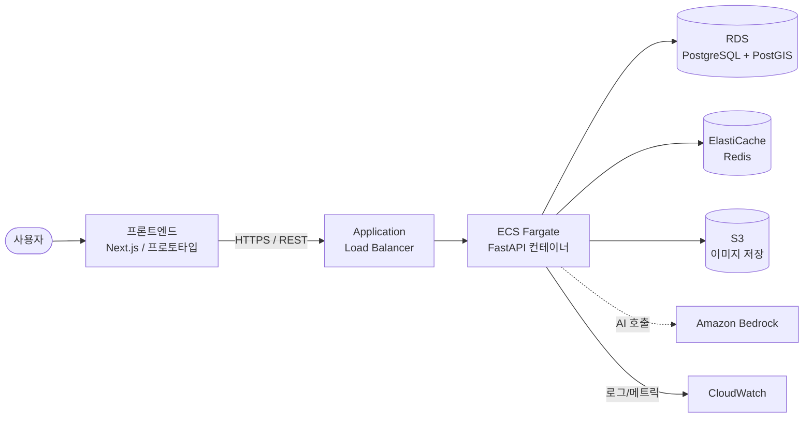

<div align="center">

# 🐾 PawTrace — Pet Adoption Transparency Platform

**Know where every paw begins.**

신뢰할 수 있는 보호소와 강아지의 이력을 **지도와 타임라인**으로 투명하게 보여주어,
건강한 입양 문화를 돕는 풀스택 + 클라우드 네이티브 플랫폼.

<br/>


> 📌 이 저장소는 **공개용 문서 저장소**입니다. 실제 소스 코드는 비공개로 관리되며,
> 채용 담당자와 기술 면접관이 **코드를 보지 않고도 프로젝트 전체를 이해**할 수 있도록 설계되었습니다.

</div>

---

## 📚 문서 가이드

| 문서 | 내용 | 추천 독자 |
|---|---|---|
| **[ARCHITECTURE.md](./ARCHITECTURE.md)** | 시스템 아키텍처, 레이어 설계, 요청 생명주기 | 기술 면접관 |
| **[INFRASTRUCTURE.md](./INFRASTRUCTURE.md)** | AWS 인프라, 네트워크, 보안, IAM 설계 | Cloud/SRE 면접관 |
| **[CI-CD.md](./CI-CD.md)** | 배포 파이프라인 2종, OIDC, GitOps, 보안 게이트 | DevOps 면접관 |
| **[DECISIONS.md](./DECISIONS.md)** | 주요 기술 의사결정 기록 (ADR) | 시니어/CTO |
| **[TROUBLESHOOTING.md](./TROUBLESHOOTING.md)** | 실제로 부딪힌 문제와 해결 과정 | 모든 면접관 |
| **[FEATURES.md](./FEATURES.md)** | 제품 기능 (비기술) | 채용 담당자 |
| **[ROADMAP.md](./ROADMAP.md)** | SRE/Cloud 강화 로드맵 | 시니어/CTO |

---

## 1. 프로젝트 개요 (Overview)

PawTrace는 입양을 고려하는 사용자가 **신뢰할 수 있는 보호소**와 **강아지의 전 생애 이력**을
지도·타임라인 형태로 확인할 수 있게 하는 서비스입니다.

- **지도 기반 보호소 검색** — 지역별 보호소 조회 / 정부 등록 여부 / 투명성 지표
- **강아지 이력 타임라인** — 구조 → 입소 → 건강검진 → 예방접종 → 중성화 → 입양 가능 상태
- **신고/검증 시스템** — 사용자가 의심 사례를 신고, 관리자가 검토 후 투명성 지표에 반영
- **AI 보조** — 입양 후기 요약, 신고 분류, 보호소 설명 요약, 이상 키워드 탐지 *(설계)*

> ⚠️ 이 서비스는 특정 업체를 단정하거나 비난하지 않습니다.
> **공공데이터 · 사용자 신고 · 관리자 검증**에 기반한 **"투명성 지표"** 만을 제공합니다.

## 2. 왜 이 프로젝트를 만들었나 (Why)

입양 과정에서 강아지의 **출처와 이력 정보가 단절·불투명**한 경우가 많습니다.
PawTrace는 흩어진 정보를 한곳에 모아, 사용자가 **정보에 근거해 판단**할 수 있는 환경을 만듭니다.

엔지니어링 관점에서는 **"작동하는 서비스 + 설명 가능한 프로덕션급 아키텍처"** 를 목표로,
실무에서 쓰는 클라우드 네이티브 패턴(IaC, GitOps, 키리스 인증, 보안 게이트)을 직접 구현했습니다.

## 3. 해결하는 문제 (Problems It Solves)

| 문제 | PawTrace의 접근 |
|---|---|
| 강아지 출처·이력 정보가 흩어져 있음 | 단일 타임라인으로 통합 |
| 보호소 신뢰도를 판단할 근거가 없음 | 공공데이터·검증 기반 투명성 지표 |
| 의심 사례를 제보할 채널이 없음 | 신고/검증 워크플로 |
| 단정적 표현의 법적 리스크 | "검증 필요 / 투명성 낮음" 등 중립적 지표화 |

## 4. 핵심 기능 (Key Features)

자세한 내용은 **[FEATURES.md](./FEATURES.md)** 참고.

- 🗺️ 지도 기반 보호소 검색 + 상세
- 📋 강아지 개별 이력 타임라인 ("강아지 여권")
- 🚩 신고/검증 시스템
- 🤖 AI 요약·분류 보조 *(설계 단계)*
- 🛠️ 관리자 콘솔 *(설계 단계)*

## 5. 시스템 아키텍처 (System Architecture)



전체 다이어그램과 레이어 설명은 **[ARCHITECTURE.md](./ARCHITECTURE.md)** 참고.

## 6. 기술 스택 (Tech Stack)

| 영역 | 기술 |
|---|---|
| **Backend** | FastAPI (Python 3.12), Clean Architecture |
| **Frontend** | Next.js (스캐폴드) + HTML/CSS 프로토타입 |
| **Database** | PostgreSQL 16 + PostGIS (위치 검색) |
| **Cache** | Redis (ElastiCache) |
| **Container** | Docker (multi-stage), 비루트 실행 |
| **Orchestration** | AWS ECS Fargate (서버리스 컨테이너) |
| **IaC** | Terraform (S3 + DynamoDB remote state) |
| **CI/CD** | GitHub Actions (앱 배포 + 인프라 GitOps) |
| **Auth** | OIDC 키리스 (GitHub → AWS) |
| **Registry** | Amazon ECR |
| **Secrets** | AWS Secrets Manager |
| **관측성** | CloudWatch Logs / Container Insights |
| **DevSecOps** | Trivy · Syft(SBOM) · Hadolint · GitGuardian · SonarQube · Codecov · Dependabot · pre-commit |
| **AI** | Amazon Bedrock *(설계)* |

## 7. 인프라 개요 (Infrastructure Overview)

- **VPC** 안에 2개 가용영역(AZ)의 **public/private 서브넷** 분리
- 외부 트래픽은 **ALB**만 진입 → **private 서브넷의 ECS**로 전달 (직접 노출 없음)
- **RDS·Redis는 private 서브넷**에 위치, 보안그룹으로 ECS에서만 접근 허용
- private 서브넷의 아웃바운드는 **NAT Gateway** 경유
- 인프라 전체가 **Terraform 코드**로 정의 (재현 가능)

상세: **[INFRASTRUCTURE.md](./INFRASTRUCTURE.md)**

## 8. CI/CD 파이프라인

두 개의 독립된 GitHub Actions 파이프라인으로 운영합니다.

| 파이프라인 | 트리거 | 역할 |
|---|---|---|
| **앱 배포** (`deploy`) | main 푸시 | 빌드 → 보안스캔(Trivy) → SBOM → ECR push → ECS 롤링 배포 |
| **인프라** (`infra`, GitOps) | PR / 머지 | PR에 `terraform plan` 코멘트 → 머지 시 `apply` |

상세: **[CI-CD.md](./CI-CD.md)**

## 9. 보안 (Security)

- **OIDC 키리스 인증** — 장기 액세스키를 저장하지 않음
- **역할 분리(최소 권한)** — 앱 배포용 / 인프라 관리용 IAM 역할 분리
- **Secrets Manager** — DB 접속정보를 런타임에 주입 (코드/이미지에 미포함)
- **네트워크 격리** — DB/캐시는 private 서브넷, 보안그룹 체인으로 접근 제한
- **이미지 취약점 스캔** — Trivy (HIGH/CRITICAL 발견 시 배포 차단)
- **시크릿 누출 방지** — GitGuardian, pre-commit, `.gitignore`
- **공급망 가시성** — Syft로 SBOM 생성

## 10. 관측성 (Monitoring)

- **CloudWatch Logs** — 컨테이너 stdout 중앙 수집 (보존 14일)
- **Container Insights** — ECS 리소스 메트릭
- **ALB Health Check** — `/api/v1/health` 기반 헬스 판정
- 🟡 *대시보드·알람·SLO·분산 트레이싱은 [ROADMAP](./ROADMAP.md)에서 강화 중*

## 11. 문서 폴더 구조 (Documentation Only)

```
pawtrace-docs/
├─ README.md              # 이 파일 (허브)
├─ ARCHITECTURE.md        # 시스템 아키텍처
├─ INFRASTRUCTURE.md      # AWS 인프라
├─ CI-CD.md               # 파이프라인
├─ DECISIONS.md           # 기술 의사결정 기록 (ADR)
├─ TROUBLESHOOTING.md     # 트러블슈팅 사례
├─ FEATURES.md            # 제품 기능
├─ ROADMAP.md             # 강화 로드맵
├─ assets/                # 스크린샷·이미지
└─ diagrams/              # 다이어그램 소스
```

> 🔒 소스 코드, 비즈니스 로직, 시크릿, 환경변수, 엔드포인트는 이 저장소에 **포함하지 않습니다.**

## 12. 나의 역할 (My Responsibilities)

이 프로젝트는 **1인 개발**로, 기획부터 배포까지 전 과정을 직접 수행했습니다.

- ☁️ **클라우드 아키텍처 설계** — VPC/서브넷/보안그룹/IAM 전체 설계
- 🏗️ **IaC 구축** — Terraform으로 전 인프라 코드화 + remote state 구성
- 🔁 **CI/CD 파이프라인 구축** — 앱 배포 + 인프라 GitOps, OIDC 키리스 인증
- 🔐 **DevSecOps** — 이미지 스캔/SBOM/시크릿 스캔/품질 게이트 통합
- 🐳 **컨테이너화** — multi-stage Dockerfile, 비루트 실행, 헬스체크
- 🧩 **백엔드 설계** — Clean Architecture 기반 API 설계
- 📝 **문서화** — 아키텍처·의사결정·운영 문서 작성

## 13. 도전과 해결 (Challenges & Solutions)

대표 사례 (전체는 **[TROUBLESHOOTING.md](./TROUBLESHOOTING.md)**):

| 도전 | 해결 |
|---|---|
| GitHub Actions에서 AWS 장기 키 노출 위험 | **OIDC 키리스 인증**으로 전환, 역할 분리 |
| 배포용/인프라용 권한이 한 역할에 과집중 | **2-역할 분리**(최소 권한) 설계 |
| Terraform state 폴더 혼선으로 리소스 중복 생성 위험 | **remote state(S3+DynamoDB Lock)** 도입, "state는 단일 진실원천" 원칙 확립 |
| 로컬 CLI 설치 후에도 "명령어 인식 불가" | 프로세스 시작 시점 **PATH 로딩** 메커니즘 이해 → 환경 재시작으로 해결 |
| 프론트엔드↔API **CORS** 차단 | 허용 오리진을 환경변수로 분리·주입 |

## 14. 배운 점 (Lessons Learned)

- **IaC는 "문서이자 실행물"** — 인프라를 코드로 관리하니 재현·리뷰·롤백이 가능해짐
- **키리스(OIDC)가 표준** — 자격증명을 "저장"하지 않는 설계가 보안의 출발점
- **state가 진실의 원천** — Terraform에서 가장 조심해야 할 것은 코드가 아니라 state
- **보안은 파이프라인에 내장(Shift-Left)** — 사람이 기억하는 대신 게이트가 강제
- **비용 인식** — 평소 `destroy`, 필요 시 5분 `apply`로 재현하는 운영 전략

## 15. 향후 개선 (Future Improvements)

SRE/Cloud 역량 강화에 초점을 둔 로드맵 (상세 **[ROADMAP.md](./ROADMAP.md)**):

- 📊 **관측성** — CloudWatch 대시보드 + 알람 + SLO/SLI + 분산 트레이싱(OTel→X-Ray)
- 📈 **오토스케일링** + **k6 부하테스트**로 용량 검증
- 🔵 **Blue/Green 무중단 배포** + 자동 롤백
- 🔒 **HTTPS(ACM) + WAF**
- 🧱 **Terraform 모듈화** + **Infracost**(PR 비용 코멘트) + **multi-env**(dev/stg/prod)

---

<div align="center">

**PawTrace** · *Know where every paw begins.* 🐾

이 문서는 실제 구현(소스 비공개)을 기반으로 작성되었습니다.

</div>
