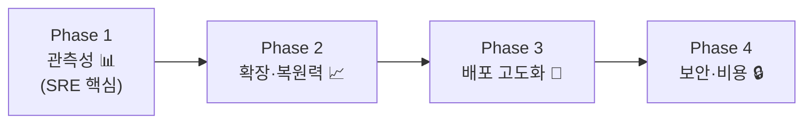

# 🗺️ ROADMAP — 강화 로드맵 (SRE / Cloud 집중)

> **목적**: 현재 구현 상태를 솔직히 보여주고, **SRE / Cloud Engineer 역량**을 부각하는
> 다음 단계를 단계별로 정리합니다. 모든 항목은 "왜 필요한가 + 면접 포인트"를 포함합니다.

---

## 현재 상태 (Baseline) ✅

이미 구현되어 강점으로 제시 가능한 것들:

- VPC 2-AZ 네트워크 격리, 보안그룹 체인 (최소 권한)
- ECS Fargate + Container Insights, IAM 역할 4종 분리
- RDS(암호화·비공개) + ElastiCache + S3 + Secrets Manager
- Terraform IaC + Remote State(S3/DynamoDB Lock)
- CI/CD: 앱 배포 + 인프라 GitOps, **OIDC 키리스**
- DevSecOps 게이트: Trivy · SBOM · Hadolint · GitGuardian · SonarQube · Codecov

## 갭 분석 (왜 로드맵이 필요한가)

| 영역 | 현재 | 부족한 점 | 직군 |
|---|---|---|---|
| 관측성 | 로그·Insights | 대시보드·알람·SLO·트레이싱 없음 | **SRE** |
| 확장성 | 고정 태스크 수 | 오토스케일링·부하검증 없음 | **SRE** |
| 배포 | 롤링 + 자동 롤백(서킷브레이커) | Blue/Green(CodeDeploy)·카나리 없음 | **DevOps** |
| 네트워크 보안 | HTTP·단일 NAT | HTTPS·WAF·NAT HA 없음 | **Cloud** |
| IaC 성숙도 | 단일 환경 | 모듈화·multi-env·비용가시화 없음 | **Cloud** |
| 복원력 | 기본 | 백업/DR 전략 미흡 | **SRE** |

---

## Phase 1 — 관측성 (Observability) 📊 *최우선*

> SRE 시그널이 가장 약한 영역. 채우면 차별화 효과가 가장 큼.

| 작업 | 도구 | 면접 포인트 |
|---|---|---|
| 구조화 로깅(JSON) | 앱 + CloudWatch | "요청을 필드로 검색·집계" |
| 메트릭 대시보드 | CloudWatch Dashboard | "골든 시그널(지연·트래픽·에러·포화) 가시화" |
| 알람 + 통지 | CloudWatch Alarm → SNS/Slack | "5xx 급증·지연 악화 시 자동 알림" |
| **SLO/SLI + 에러버짓** | 문서 + 메트릭 | "가용성 목표와 알람 임계치의 근거" |
| 분산 트레이싱 | OpenTelemetry → X-Ray | "요청이 레이어를 흐르는 경로 추적" |

**완료 기준**: 대시보드에서 p50/p95 지연·에러율을 보고, 임계치 초과 시 알림 수신.

## Phase 2 — 확장성 & 복원력 (Scalability & Resilience) 📈

| 작업 | 도구 | 면접 포인트 |
|---|---|---|
| ECS 오토스케일링 | Application Auto Scaling | "CPU/요청 기반 자동 증감" |
| 부하 테스트 | **k6** | "초당 N요청까지 검증, 병목 식별" |
| RDS 백업/스냅샷 | RDS 자동 백업·PITR | "데이터 복구 전략(RPO/RTO)" |
| Multi-AZ DB | RDS Multi-AZ | "DB 장애 자동 페일오버" |
| NAT 고가용성 | AZ별 NAT | "단일 장애점 제거" |

**완료 기준**: k6로 부하를 주면 태스크가 자동 증가하고, 결과 리포트로 용량을 설명.

## Phase 3 — 배포 고도화 (Progressive Delivery) 🔵

| 작업 | 도구 | 면접 포인트 |
|---|---|---|
| Blue/Green 배포 | CodeDeploy for ECS | "다운타임 0, 실패 시 자동 롤백" |
| 배포 후 스모크 테스트 | CI 스텝 | "헬스 실패 시 이전 버전 복귀" |
| DB 마이그레이션 자동화 | Alembic in CI | "스키마 변경도 파이프라인으로" |
| 환경 분리 | Terraform workspace | "dev/staging/prod 격리" |

**완료 기준**: 배포 중 무중단 확인, 의도적 실패 주입 시 자동 롤백 동작.

## Phase 4 — 네트워크 보안 & 비용 (Security & Cost) 🔒

| 작업 | 도구 | 면접 포인트 |
|---|---|---|
| HTTPS | ACM + Route53 + ALB 443 | "TLS 종단, http→https 리다이렉트" |
| 웹 방화벽 | AWS WAF | "SQLi·과도요청(rate limit) 차단" |
| Terraform 모듈화 | TF modules | "재사용 가능한 IaC 설계" |
| 비용 가시화 | **Infracost** | "PR에 변경 비용 코멘트" |
| CDN | CloudFront | "정적 자산 엣지 캐싱" |

**완료 기준**: HTTPS로 서비스 접근, PR에 예상 비용 코멘트 표시.

---

## 우선순위 한눈에

> **전략**: 파이썬 비중이 낮은 SRE/Cloud 직군을 노리므로,
> **인프라·관측성·자동화·비용** 중심 항목을 우선한다.
> 대부분 **앱 코드보다 Terraform/워크플로/설정** 작업이라 방향과 일치.

## 가성비 Top 3 (가장 먼저 추천)

1. **관측성 스택** (대시보드 + 알람 + SLO) — SRE 시그널 즉시 강화, 거의 무료
2. **오토스케일링 + k6 부하테스트** — "데이터로 증명하는 확장성" 스토리
3. **Blue/Green + 자동 롤백** — DevOps 핵심 역량 증명

## 진행 원칙

- 각 Phase 완료 시 **스크린샷·짧은 회고**를 문서에 추가 → 성장 서사 축적
- 비용 항목은 **데모 시에만 apply**, 평소 destroy (IaC 덕분에 5분 재현)
- 모든 변경은 **PR + plan 리뷰**(GitOps)로 반영

---

📎 관련 문서: [README.md](./README.md) · [INFRASTRUCTURE.md](./INFRASTRUCTURE.md) · [CI-CD.md](./CI-CD.md)
